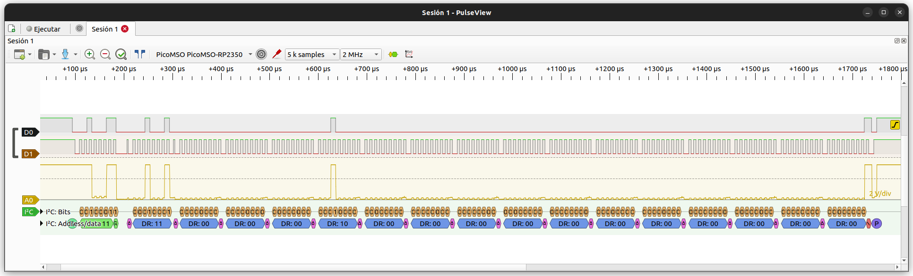

# PicoMSO

PicoMSO is an RP2040/RP2350-based mixed-signal instrument that combines a
hardware-triggered logic analyzer and oscilloscope into a single firmware and
libsigrok-compatible device.

It enables **synchronized digital and analog capture** with deterministic,
hardware-level triggering using PIO and DMA.

---

## Features

- Mixed-signal capture (logic + analog in one session)
- Deterministic **hardware triggering (PIO + DMA)**
- No sample loss or software-trigger latency
- Seamless integration with **libsigrok** and **PulseView**
- Support for **RP2040** and **RP2350**
- Prebuilt **PicoMSO Desktop binaries** for easy setup

---

## Specifications

### Logic analyzer

- **Channels:** 16 digital
- **Max sample rate:** up to **200 MHz**
- **Capture depth:**
  - RP2040: up to **40 ksamples**
  - RP2350: up to **80 ksamples**
- **Pre-trigger buffer:** up to **4 ksample**
- **Triggering:** level and edge (hardware, real-time)

### Oscilloscope

- **Channels:**
  - 1 × 12-bit
  - 2 × 8-bit (simultaneous)
- **Max sample rate:** up to **2 MS/s**
- **Pre-trigger:** hardware circular buffer

---

## Hardware variants

| MCU    | Features            | Capture depth |
|--------|---------------------|---------------|
| RP2040 | Full feature set    | Standard      |
| RP2350 | Same + extended RAM | Increased     |

---

## Sample-rate limits

- Analog enabled → **max 2 MS/s**
- Logic-only → up to **200 MHz**

Requests beyond limits are rejected by the driver.

---

## Triggering architecture

PicoMSO implements triggering entirely in hardware using **PIO + DMA**:

- No firmware latency
- No missed samples
- Fully deterministic capture start

This is a key difference compared to host-triggered devices.

---

## Quick start

### 1. Flash firmware

Download from:  
https://github.com/dgatf/PicoMSO/releases

Steps:

1. Hold **BOOTSEL**
2. Plug USB
3. Copy `.uf2` to `RPI-RP2`
4. Done

---

### 2. Install PicoMSO Desktop

Prebuilt desktop binaries with PicoMSO support are available here:  
https://github.com/dgatf/pulseview/releases

Available packages:

- **Linux:** AppImage
- **Windows:** portable ZIP package
- **macOs:** DMG package

This is the recommended way to use PicoMSO.

---

### 3. Start capturing

1. Connect your PicoMSO device via USB
2. Launch PicoMSO Desktop
3. Select the PicoMSO device from the device list
4. Configure channels, samplerate, and trigger
5. Click **Run**

---

## PulseView

PicoMSO works directly with PulseView for interactive visualization of
mixed-signal captures.




---

## Advanced documentation

For development details and manual host-side setup, see:

- docs/building.md
- docs/architecture.md
- docs/protocol.md
- docs/libsigrok.md

---

## Build (firmware)

```bash
git submodule update --init --recursive
cmake -S firmware/app -B build/picomso
cmake --build build/picomso
```

---

## Signal integrity note

For best results on high-speed logic signals:

- Add ~**600 Ω series resistor**
- Optional RC filtering for noisy environments

This significantly improves trigger stability and reduces glitches.

---

## Status

PicoMSO is stable and fully functional for core mixed-signal capture.

Planned improvements:

- Analog triggering
- Enhanced RP2350 support
- Extended capture configurations

---

## License

GPL v3 (see LICENSE file)