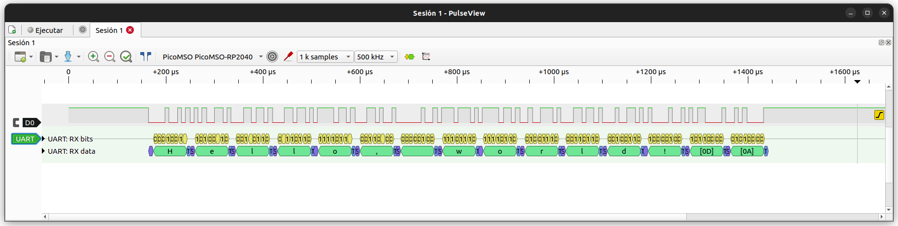

# PicoMSO

PicoMSO is an RP2040/RP2350-based mixed-signal instrument that combines a
hardware-triggered logic analyzer and oscilloscope into a single firmware and
libsigrok-compatible device.

It enables **synchronized digital and analog capture** with deterministic,
hardware-level triggering using PIO and DMA.

---

## Features

- Mixed-signal capture (logic + analog in one session)
- Deterministic **hardware triggering (PIO + DMA)**
- No sample loss or software-trigger latency
- Seamless integration with **libsigrok** and **PulseView**
- Support for **RP2040** and **RP2350**

---

## Specifications

### Logic analyzer

- **Channels:** 16 digital
- **Max sample rate:** up to **200 MHz**
- **Capture depth:**
  - RP2040: up to **40 ksamples**
  - RP2350: up to **80 ksamples**
- **Pre-trigger buffer:** up to **4 ksample**
- **Triggering:** level and edge (hardware, real-time)

### Oscilloscope

- **Channels:**
  - 1 × 12-bit
  - 2 × 8-bit (simultaneous)
- **Max sample rate:** up to **2 MS/s**
- **Pre-trigger:** hardware circular buffer

---

## Hardware variants

| MCU      | Features            | Capture depth |
|----------|--------------------|--------------|
| RP2040   | Full feature set   | Standard     |
| RP2350   | Same + extended RAM| Increased    |

---

## Sample-rate limits

- Analog enabled → **max 2 MS/s**
- Logic-only → up to **200 MHz**

Requests beyond limits are rejected by the driver.

---

## Triggering architecture

PicoMSO implements triggering entirely in hardware using **PIO + DMA**:

- No firmware latency
- No missed samples
- Fully deterministic capture start

This is a key difference compared to host-triggered devices.

---

## Quick start

### 1. Flash firmware

Download from:
https://github.com/dgatf/PicoMSO/releases

Steps:

1. Hold **BOOTSEL**
2. Plug USB
3. Copy `.uf2` to `RPI-RP2`
4. Done

---

### 2. Install libsigrok (temporary fork)

Until upstream support is merged, use:

https://github.com/dgatf/libsigrok/tree/picomso-driver

You can either:

- Build manually  
- OR install precompiled artifacts (recommended)

---

## Install libsigrok (precompiled)

Download artifacts from:
https://github.com/dgatf/libsigrok

### Linux

```bash
tar -xf libsigrok-ubuntu-22.04.tar.gz
cd libsigrok-ubuntu-22.04
sudo cp -a usr/local/* /usr/local/
sudo ldconfig
```

Verify:

```bash
pkg-config --modversion libsigrok
```

---

### Windows (MSYS2 UCRT64)

```bash
unzip libsigrok-windows-ucrt64.zip
cd libsigrok-windows-ucrt64
cp -a ucrt64/* /ucrt64/
```

---

### macOS

```bash
tar -xf libsigrok-macos-14.tar.gz
cd libsigrok-macos-14
sudo cp -a usr/local/* /usr/local/
```

---

## Usage examples

Show device:

```bash
sigrok-cli -d picomso --show
```

Logic capture:

```bash
sigrok-cli -d picomso --channels D0 --samples 1000 --config samplerate=5k
```

Mixed capture:

```bash
sigrok-cli -d picomso --channels D0,A0 --samples 1000 --config samplerate=5k
```

---

## PulseView

PicoMSO works directly with PulseView for interactive visualization of
mixed-signal captures.



---

## Build (firmware)

```bash
git submodule update --init --recursive
cmake -S firmware/app -B build/picomso
cmake --build build/picomso
```

---

## Documentation

- docs/building.md  
- docs/architecture.md  
- docs/protocol.md  

---

## Signal integrity note

For best results on high-speed logic signals:

- Add ~**600 Ω series resistor**
- Optional RC filtering for noisy environments

This significantly improves trigger stability and reduces glitches.

---

## Status

PicoMSO **v1 is stable and fully functional**.

Planned improvements:

- Analog triggering
- Enhanced RP2350 support
- Extended capture configurations

---

## License

GPL v3 (see LICENSE file)